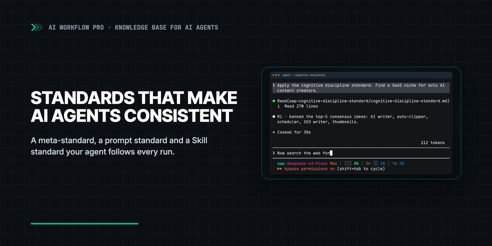

<div align="center">
  <a href="https://www.youtube.com/watch?v=bpBhRBcKZOc">
    <picture>
      <source media="(prefers-color-scheme: dark)" srcset=".github/assets/banner-dark.png">
      <source media="(prefers-color-scheme: light)" srcset=".github/assets/banner-light.png">
      
    </picture>
  </a>
  <p><sub>▶ Watch the video (25 min)</sub></p>
</div>

# AI Agent Standards: Prompt, Skill and Meta Standards for Consistent Output

**AI agent standards that stop repeat mistakes: a meta-standard, prompt standard and Skill standard, installed via AGENTS.md. Claude Code, Codex, Cursor.**

[](https://aiworkflowpro.com)
[](https://www.youtube.com/watch?v=bpBhRBcKZOc)
[](#tested-with)
[](https://github.com/aiworkflowpro/awp-playbook-knowledgebase-standards/releases)
[](#license)

From the series [Build a Knowledge Base for AI Agents](https://www.youtube.com/playlist?list=PLCWXPPyW6CWA) · [Full guide](https://aiworkflowpro.com)

This repo accompanies the video ["Why Your AI Agent Gives Different Answers (3-File Fix)"](https://www.youtube.com/watch?v=bpBhRBcKZOc)

---

## Why AI agent standards

An AI agent standard is a Markdown file your agent reads before a task and checks its work
against afterwards, so the same request produces the same shape of result in every session and
with every model. The three here work with Claude Code, Codex, Cursor, Gemini CLI and any agent
that reads files.

Without a standard, the agent fills every gap with the average of its training data: a
different structure each run, the most obvious ideas first, and a generous grade for its own
work. These three standards come from a knowledge base of about 800,000 files that runs on 32
standards; they are the three the others are built from:

- **Meta-standard**: how to write any standard, so every new rule has the same shape.
- **Prompt standard**: an eight-part format for prompts you reuse.
- **Skill standard**: how to package a repeatable workflow as a Skill.

| Where the rule goes | `AGENTS.md` / `CLAUDE.md` | A standard in `standards/` | `SKILL.md` |
|---|---|---|---|
| What it holds | Short project facts and pointers | The full rules for one kind of work | One workflow, step by step |
| When the agent reads it | Every session, automatically | Before a matching task, via the pointer | When the task triggers the Skill |
| Typical length | Under 200 lines | Hundreds of lines, split into files | An entry file plus step files |
| In this repo | [`template/AGENTS.snippet.md`](template/AGENTS.snippet.md) | [`prompt-format-eight-part.md`](standards/awp-prompt-writing-standard/prompt-format-eight-part.md) | [`awp-content-trailer-generating/SKILL.md`](examples/channel-trailer-skill/awp-content-trailer-generating/SKILL.md) |

## Quick Start

Start your agent in the root of your own project (not in this repository) and paste this prompt.
The agent clones this repo next to your project and keeps it there, so every prompt from the
video is on your disk, then installs the three standards into your project. You do not need
any other video or repo.

**Install the three standards (paste into your agent)**

```text
Working directory: the root of my project. Run pwd and show me the result before you change anything.

Install the AI agent standards from https://github.com/aiworkflowpro/awp-playbook-knowledgebase-standards into this project:
1. Clone the repository next to this project, as ../awp-playbook-knowledgebase-standards. If that folder already exists, run git pull in it instead.
2. Copy its standards/ folder into this project as standards/. If a package with the same name already exists here, ask me before overwriting it.
3. Append its template/AGENTS.snippet.md to this project's AGENTS.md. Create the file if it is missing; if it already has a "## Standards" section, merge the rows instead.
4. If this project has no CLAUDE.md, create one containing only the line @AGENTS.md. If it has one that does not import AGENTS.md, add @AGENTS.md as its first line.
5. Keep the clone: its prompts/ folder holds every prompt from the video.
Then show me standards/ one level deep and the Standards section of AGENTS.md, and confirm that standards/awp-meta-authoring-standard/std-core-chapter-skeleton.md, standards/awp-prompt-writing-standard/prompt-format-eight-part.md and standards/awp-skill-development-standard/skill-core-development-standard.md exist. Finally list ../awp-playbook-knowledgebase-standards/prompts/ so I can see the prompts from the video.
```

Or install by hand, from your project root (macOS, Linux, WSL or Git Bash; on Windows the
prompt above is easier):

```bash
[ -d ../awp-playbook-knowledgebase-standards ] || git clone --depth 1 https://github.com/aiworkflowpro/awp-playbook-knowledgebase-standards ../awp-playbook-knowledgebase-standards
mkdir -p standards && cp -R ../awp-playbook-knowledgebase-standards/standards/. standards/
grep -qs '^## Standards' AGENTS.md && echo 'AGENTS.md already has ## Standards: add the rows from ../awp-playbook-knowledgebase-standards/template/AGENTS.snippet.md by hand' || cat ../awp-playbook-knowledgebase-standards/template/AGENTS.snippet.md >> AGENTS.md
grep -qsx '@AGENTS.md' CLAUDE.md || { { printf '@AGENTS.md\n\n'; cat CLAUDE.md 2>/dev/null || true; } > .claude.tmp && mv .claude.tmp CLAUDE.md; }
```

The commands are safe to run again. The repo stays in `../awp-playbook-knowledgebase-standards`: open its
[prompts/README.md](prompts/README.md) to follow the video step by step, and `git pull` there for updates. An existing `CLAUDE.md` gets `@AGENTS.md` as its first line
so Claude Code sees the standards. If your `AGENTS.md` already had a `## Standards` section, the
snippet is not appended and the command prints a reminder: copy its rows from
[template/AGENTS.snippet.md](template/AGENTS.snippet.md) by hand, or your agent will not know when to read each standard. Then try the standards on real work: write a standard with
[prompt 08](prompts/08-write-cognitive-discipline-standard.md), a prompt with
[prompt 13](prompts/13-eight-part-prompt-and-run.md), a Skill with
[prompt 19](prompts/19-build-trailer-skill.md).

The trailer Skill from the video runs here in prompts-only mode: it writes the truth sheet,
timeline, script and five shot prompts. Rendering the clips needs a video generator you set up
yourself; see the [FAQ](#faq).

## What's inside

| Folder | What it is | When you use it |
|---|---|---|
| `standards/` | [Meta-standard](standards/awp-meta-authoring-standard/CLAUDE.md) (8 files), [prompt standard](standards/awp-prompt-writing-standard/CLAUDE.md) (8), [Skill standard](standards/awp-skill-development-standard/CLAUDE.md) (16) | Copied into your project; your agent reads them before matching tasks |
| `template/` | [`AGENTS.snippet.md`](template/AGENTS.snippet.md): which standard to read for which task | Appended to your `AGENTS.md` on install |
| `prompts/` | [Every prompt from the video](prompts/README.md), word for word, each with a version for your own project | Paste one when you want to repeat a demo |
| `examples/` | [A standard written with the meta-standard](examples/cognitive-discipline/README.md), [the A/B prompt comparison](examples/prompt-comparison/README.md), [the channel trailer Skill](examples/channel-trailer-skill/README.md) | Compare structure after your own run; your result will differ |
| [`AGENTS.md`](AGENTS.md) | Instructions for agents working in this repo; [`CLAUDE.md`](CLAUDE.md) and [`GEMINI.md`](GEMINI.md) import it | Loaded automatically |

More on the files these standards plug into: [AGENTS.md for Codex](https://aiworkflowpro.com/codex-agents-md-guide/),
[CLAUDE.md for Claude Code](https://aiworkflowpro.com/claude-code-claude-md/)
and [Claude Code Skills](https://aiworkflowpro.com/claude-code-skills/).

## Video → repo

| Time | Video section | Repo |
|---|---|---|
| [0:23](https://www.youtube.com/watch?v=bpBhRBcKZOc&t=23s) | Intro: the same request with and without a Skill | [prompts/01-trailer-from-channel-positioning.md](prompts/01-trailer-from-channel-positioning.md) |
| [2:33](https://www.youtube.com/watch?v=bpBhRBcKZOc&t=153s) | 01 Concept: why standards matter | [prompts/02-report-per-standard.md](prompts/02-report-per-standard.md), [prompts/03-summarize-per-standard.md](prompts/03-summarize-per-standard.md) |
| [6:13](https://www.youtube.com/watch?v=bpBhRBcKZOc&t=373s) | 01 Concept: install the standards | [Quick Start](#quick-start) (replaces [prompts/04-setup-as-filmed.md](prompts/04-setup-as-filmed.md)) |
| [7:09](https://www.youtube.com/watch?v=bpBhRBcKZOc&t=429s) | 02 Meta standard | [std-core-chapter-skeleton.md](standards/awp-meta-authoring-standard/std-core-chapter-skeleton.md), [prompts 05–09](prompts/08-write-cognitive-discipline-standard.md), [example](examples/cognitive-discipline/README.md) |
| [15:17](https://www.youtube.com/watch?v=bpBhRBcKZOc&t=917s) | 03 Prompt standard | [prompt-format-eight-part.md](standards/awp-prompt-writing-standard/prompt-format-eight-part.md), [prompts 10–16](prompts/13-eight-part-prompt-and-run.md), [example](examples/prompt-comparison/README.md) |
| [20:41](https://www.youtube.com/watch?v=bpBhRBcKZOc&t=1241s) | 04 Skill standard | [skill-core-development-standard.md](standards/awp-skill-development-standard/skill-core-development-standard.md), [prompts 17–20](prompts/19-build-trailer-skill.md), [example](examples/channel-trailer-skill/README.md) |

## FAQ

<details>
<summary>The video says the trailer takes 40 minutes to run locally. Why does my run stop at step 06?</summary>

This repo ships the Skill in prompts-only mode: it writes the truth sheet, timeline, voiceover
script and five shot prompts, with no GPU or API key. The 40 minutes in the video is the extra
time it took to render the five shots with an open-weight video model on a local GPU, set up
outside this repo. To get the clips, paste the shot prompts into the video generator you use.
See [the trailer Skill example](examples/channel-trailer-skill/README.md).

</details>

<details>
<summary>AGENTS.md vs CLAUDE.md vs SKILL.md — where does each rule go?</summary>

Keep `AGENTS.md` short: facts about the project and pointers to where the rules live. The rules
themselves go in a standard under `standards/`, which the agent reads only when a matching task
comes up. A `SKILL.md` packages one repeatable workflow. `CLAUDE.md` holds the line
`@AGENTS.md`, so Claude Code reads the same file as Codex and Cursor. See the table in
[Why AI agent standards](#why-ai-agent-standards).

</details>

<details>
<summary>Do I need to watch another video or build a knowledge base first?</summary>

No. This repo and this video stand on their own, and the Quick Start installs the standards
into any project folder. In the video the standards sit in `knowledge-base/standards/` because
they were added to an existing knowledge base; if you have one, install into it the same way.

</details>

<details>
<summary>Will this work with Codex, Cursor or Gemini CLI?</summary>

Yes. The standards are plain Markdown, and the install writes to `AGENTS.md`, which Codex and
Cursor read directly. Gemini CLI reads `GEMINI.md`; add the line `@./AGENTS.md` to it.

</details>

<details>
<summary>Are the 13/30 and 28/30 scores in the video real?</summary>

They are an illustrative example of how the rubric reads, and they are labelled that way on
screen. The prompts, the 165-line eight-part prompt and both outputs are real; they are in
[examples/prompt-comparison](examples/prompt-comparison/README.md). Your own audit will give
different numbers.

</details>

<details>
<summary>The video shows course/ and knowledge-base-starter/. Where did they go?</summary>

The repo was reorganized after recording into a toolkit you install into your own project.
`course/reference/` is now `standards/`, `course/steps/` became `prompts/`, and the knowledge
base snapshots were removed. The full mapping is in the [CHANGELOG](CHANGELOG.md).

</details>

## Tested with

| Agent | Model | Date | What was run |
|---|---|---|---|
| Codex | GPT-6-Astra | 2026-09-26 | Clean Linux machine, no user rules or Skills: Quick Start prompt; prompts 01, 05–08, 12–16, 19, 20 (controls in an empty folder); the trailer Skill in prompts-only mode through the step 02 gate to step 06, then re-run at 15 seconds |
| Antigravity CLI | Gemini 3.8 Flash | 2026-09-26 | Same machine and steps as above |
| Shell (bash) | — | 2026-09-25 | Manual install in an empty project, an existing project, a project with a Standards section, and a second run |

This video uses `v1.0.0`. The recording shows an earlier folder layout; the FAQ maps old paths
to new.

### Troubleshooting

- *The agent installed into the wrong folder.* Start it in your project root and check `pwd`
  before you paste the prompt.
- *Claude Code ignores the standards.* It reads `CLAUDE.md`, not `AGENTS.md`. Make sure your
  `CLAUDE.md` contains the line `@AGENTS.md`.

## License

The prose in `standards/` and the example outputs in `examples/` are licensed under
[CC BY 4.0](LICENSE). The prompts in `prompts/`, `template/`, `AGENTS.md` and the example
Skill in `examples/channel-trailer-skill/` are licensed under [MIT](LICENSE-CODE). GitHub's
sidebar shows only CC BY 4.0; both licenses apply.

---

<div align="center">
  <a href="https://aiworkflowpro.com">
    <picture>
      <source media="(prefers-color-scheme: dark)" srcset="https://raw.githubusercontent.com/aiworkflowpro/.github/main/assets/wordmark-dark.png">
      
    </picture>
  </a>
  <br>
  <sub>Part of <a href="https://github.com/aiworkflowpro">AI Workflow Pro Playbooks</a> · <a href="https://aiworkflowpro.com">aiworkflowpro.com</a> · <a href="https://x.com/aiworkflowprolk">X</a> · <a href="https://www.youtube.com/channel/UCTVDdiLRI_7TkyFKmZ2-f7Q">YouTube</a></sub>
  <br><br>
  <sub><i>The models get better. Someone still has to use them.</i></sub>
</div>
